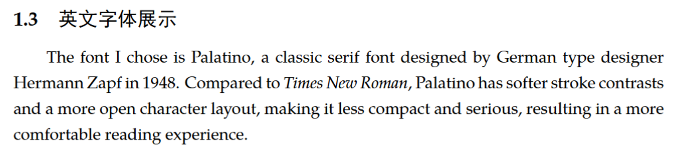
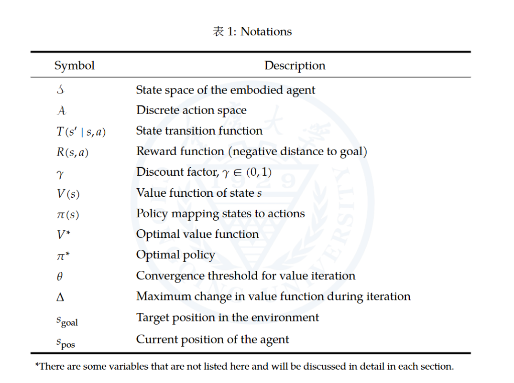
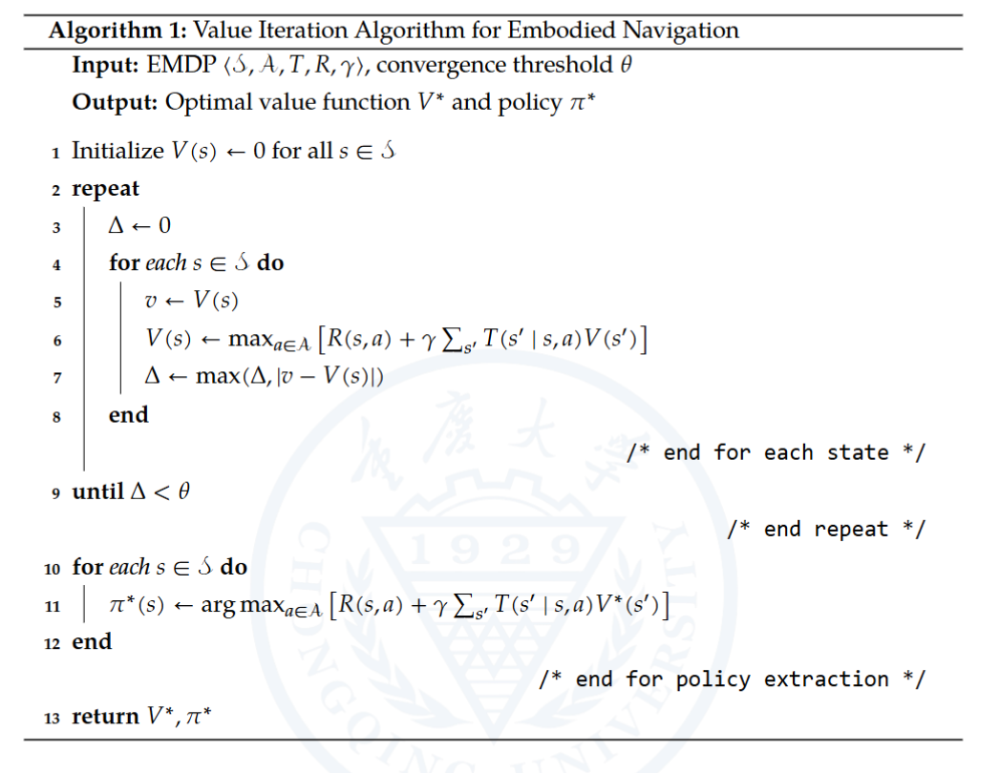
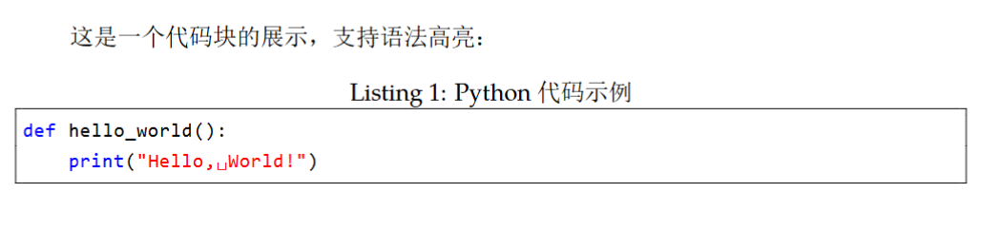
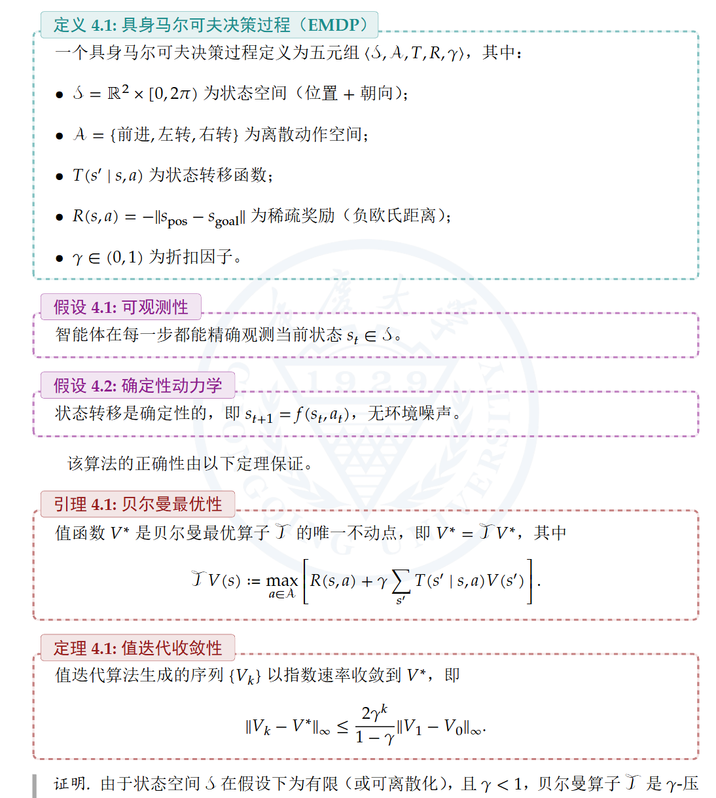

# 自制的优雅好用LaTeX笔记模版

本仓库整理了我个人自用的LaTeX笔记模版，初衷是为了方便自己记录与阅读含有大量数理知识与算法代码的笔记。在此分享给大家，也方便大家更好地记笔记。这套模版虽有鲜明的个人风格，但可编辑性与可扩展性强，大家完全可以取长补短，在此基础上DIY一套适合自己喜好与审美的笔记模版。

## 快速导航

- [自制的优雅好用LaTeX笔记模版](#自制的优雅好用latex笔记模版)
  - [快速导航](#快速导航)
  - [项目结构](#项目结构)
  - [具体部分展示](#具体部分展示)
    - [1. 字体选择](#1-字体选择)
    - [2. 三线表](#2-三线表)
    - [3. 伪代码](#3-伪代码)
    - [4. 代码块](#4-代码块)
    - [5. 彩色信息框](#5-彩色信息框)

## 项目结构

```text
DIY_LaTeX_Template/
├── main.tex                  ← 主文档（唯一入口）
├── main.pdf                  ← 导出的 PDF 文件
├── config/
│   ├── packages.tex          ← 所有宏包加载
│   ├── styles.tex            ← 样式定义（页面、字体等样式设计）
│   └── macros.tex            ← 自定义命令与环境
├── content/
│   ├── cover.tex             ← 封面
│   ├── chapter1.tex          ← 第一章内容
│   ├── chapter2.tex          ← 第二章内容
│   └── ...                   ← 后续章节
├── assets/
│   ├── figures/              ← 图片目录
│   └── logos/                ← Logo 等公共图片
├── bib/
│   └── references.bib        ← 文献数据库
├── .gitignore                ← Git 忽略文件
└── README.md                 ← 使用说明
```

## 具体部分展示

### 1. 字体选择

中文字体选择了自带的标准**思源宋体**，英文与数字字体选用了更优雅易读的**Palatino**字体（替换默认的Times New Roman），效果如下：


### 2. 三线表

三线表效果如下：



### 3. 伪代码

伪代码效果如下：



### 4. 代码块

代码块效果如下：



### 5. 彩色信息框

| 类型                  | 具体特征             | 色系         |
|-----------------------|---------------------|-------------|
| 定义 (Definition)         | 基础、奠基、概念性   | 青色      |
| 假设 (Assumption)         | 前提、约束、理想化   | 紫色      |
| 定理/引理/命题 (Theorem etc.) | 严谨、结论、核心成果 | 深红   |
| 例子 (Example)            | 具体、说明、辅助     | 橙色      |
| 证明 (Proof)              | 推导、过程、逻辑链   | 灰色      |

彩色信息框效果如下：


